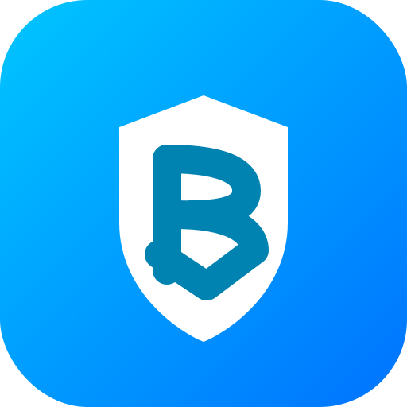
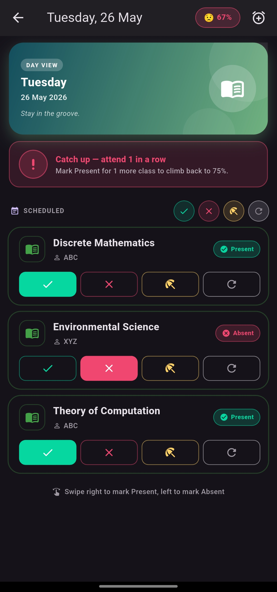
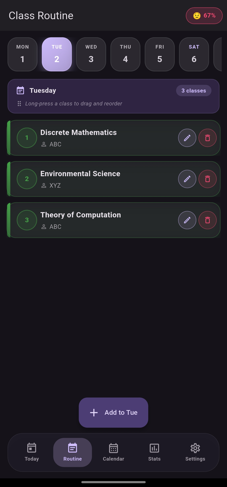
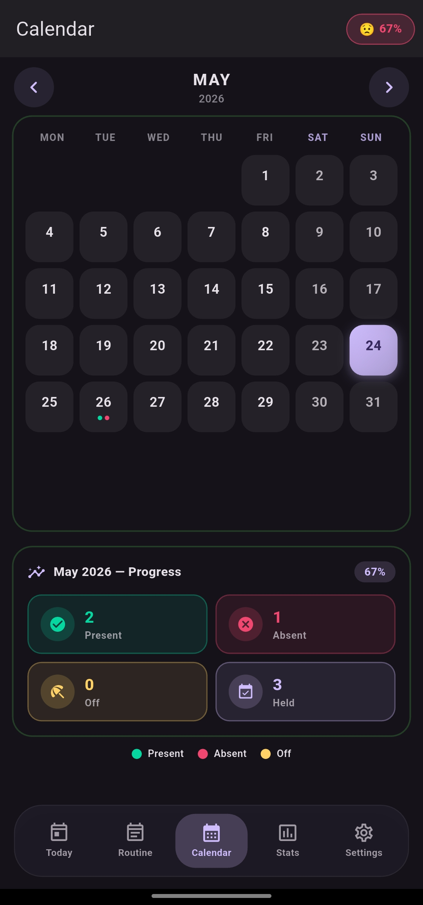
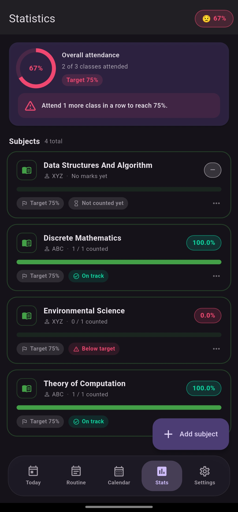
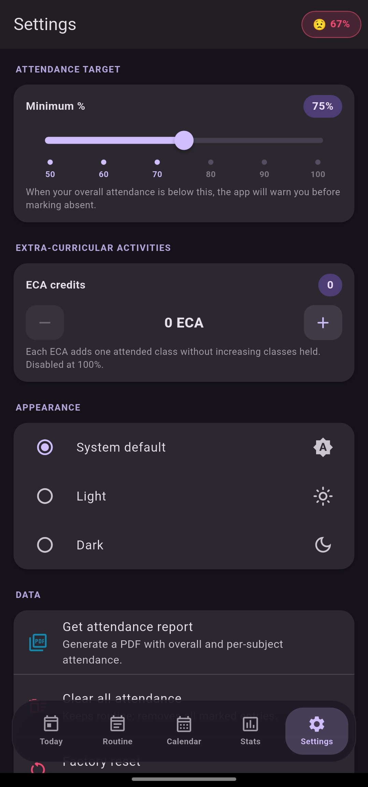

<div align="center">



# BunkSafe

**Know exactly when you can skip — and when you can't.**

A student attendance tracker built with Flutter. Set up your weekly routine once, mark each class in one tap, and let the app tell you how many classes you can safely bunk before your percentage dips below the threshold.

</div>

---

## Screenshots

<p align="center">
  
  
  
  
  
</p>

## Features

- **Weekly routine** — define your timetable once; the app generates today's class list automatically
- **One-tap marking** — Present / Absent / Off for every class
- **Live percentages** — per-subject and overall attendance, updated as you mark
- **"Safe to bunk" indicator** — see how many classes you can miss before falling below your target %
- **Calendar view** — see every marked day at a glance
- **Extra / makeup classes** — add ad-hoc sessions that fall outside the weekly routine
- **Class reminders** — timezone-aware local notifications
- **PDF export** — generate a full attendance report
- **Fully offline** — no account, no server, your data stays on your device

## Tech stack

- **Flutter** & **Dart**
- **Provider** for state management
- **SharedPreferences** for local persistence
- **flutter_local_notifications** + **timezone** for scheduled reminders
- **pdf** + **printing** for report export
- **intl** for date/time formatting

## Platforms

Android · iOS · Web · Windows · macOS · Linux — single codebase.

## Getting started

Requires Flutter SDK `^3.11.4`.

```bash
git clone https://github.com/karfa113/BunkSafe.git
cd BunkSafe
flutter pub get
flutter run
```

To build a release APK:

```bash
flutter build apk --release
```

## Project structure

```
lib/
├── main.dart                 # app entry
├── app_state.dart            # Provider state, attendance math
├── models.dart               # ClassItem, Subject, ExtraClass, AttendanceStatus
├── storage.dart              # SharedPreferences persistence
├── theme.dart                # app theming
├── screens/                  # today, calendar, routine, stats, settings, home
├── services/                 # notification scheduling
└── widgets/                  # reusable UI components
```

## License & branding

Code is released under the [MIT License](LICENSE) — you're welcome to read, learn from, and build on it.

The name **BunkSafe**, the logo, and the visual identity are **not** covered by the MIT license. Please rename and rebrand any fork before redistributing or publishing.

## Author

Built solo by **Monojit Karfa**.
# BunkSafe
